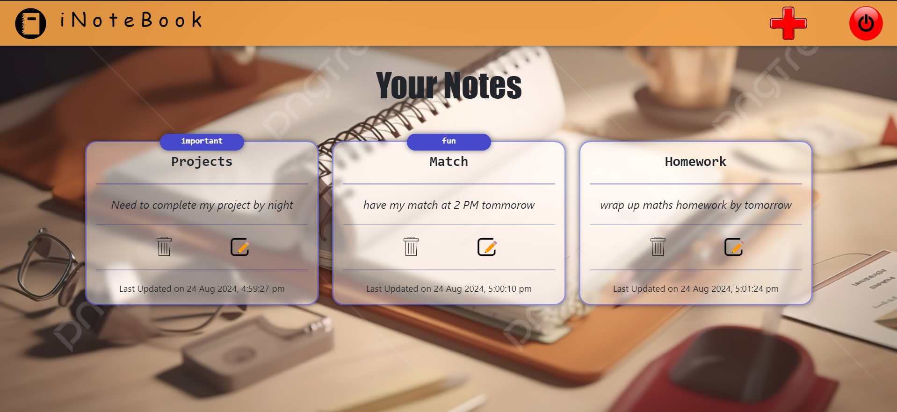

# iNoteBook

iNoteBook is a full-stack note-taking application built using the MERN stack (MongoDB, Express.js, React.js, Node.js). It allows users to create, read, update, and delete notes securely with JWT-based authentication.

## Table of Contents

- [Installation](#installation)
- [Environment Variables](#environment-variables)
- [Usage](#usage)
- [Features](#features)
- [Screenshot](#screenshot)
- [Acknowledgements](#acknowledgements)

## Installation

To get started with this project, follow these steps:

1. Clone the repository:
    ```bash
    git clone https://github.com/RudrakshKumar/inotebook.git
    ```

2. Navigate to the project directory:
    ```bash
    cd inotebook
    ```

3. Install the necessary dependencies for both backend and frontend:
    ```bash
    npm install
    cd client
    npm install
    cd ..
    ```

4. Start the development server with both backend and frontend:
    ```bash
    npm run both
    ```

## Environment Variables

This project requires a MongoDB connection string and a JWT secret for authentication. You must create a `.env` file in the root directory and add the following environment variables:

- `MONGO_URI`: Your MongoDB connection string.
- `JWT_SECRET`: A secret key for JWT token generation.

Example `.env` file:
```env
MONGO_URI=your_mongodb_connection_string_here
JWT_SECRET=your_jwt_secret_here
```

## Usage

After setting up the project as described above, run the following command to start the development server:

```bash
npm run both
```

The app will be available at http://localhost:3000.

## Features
- Secure Authentication: User authentication is handled with JSON Web Tokens (JWT).
- CRUD Operations: Users can create, read, update, and delete their notes.
- User-specific Notes: Each user can only access their own notes, ensuring privacy.

## Screenshot

Here is the home page of the website:





## Acknowledgements
- MongoDB: A NoSQL database used to store user notes.
- Express.js: A web application framework for Node.js.
- React.js: A JavaScript library for building user interfaces.
- Node.js: A JavaScript runtime for building scalable server-side applications.
